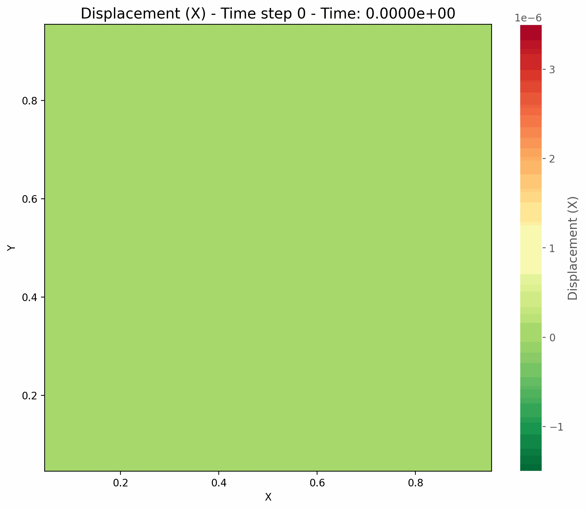
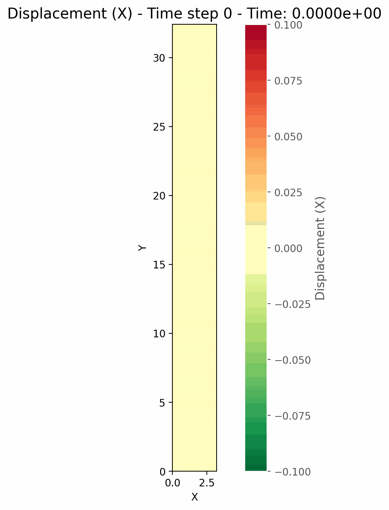

# ex-FEM

ex-FEM is a compact Python implementation of the explicit finite element method (FEM) for dynamic solid-mechanics problems. This repository contains runnable examples associated with the following work:

- Chan, K. F., Bombace, N., Falco, S., Chapman, D., Petrinic, N., & Eakins, D. (2026). "Targeted attenuation of spurious reflections in coupled wave propagation simulations." *Computational Mechanics*. [https://doi.org/10.1007/s00466-026-02826-2](https://link.springer.com/article/10.1007/s00466-026-02826-2)
- Chan, K. F. (2025). *Efficient coupling methods for the dynamic modelling of heterogeneous systems* [DPhil thesis, University of Oxford]. [https://doi.org/10.5287/ora-8j2k4ep5b](https://ora.ox.ac.uk/objects/uuid:ffd11f8e-07bb-4847-935a-943d62d28250)

## What This Shows

The code demonstrates the main operations of an explicit finite element solver in a concise, modular form. It uses four-node quadrilateral elements, an updated Lagrangian formulation, lumped nodal masses, material-state updates, internal-force assembly, and leapfrog time integration to advance a dynamic problem without solving a global system of simultaneous equations.

The included benchmarks illustrate elastic stress-wave propagation and nonlinear impact behaviour, including axisymmetric kinematics, plasticity, and bulk viscosity. The repository is intended as a clear foundation for learning, benchmarking, and developing coupling algorithms; a fuller mathematical and implementation overview is provided in Appendix B of the thesis cited above. It is not an optimised code, and its primary use is for education.

## Example Output

### Benchmark 2: Chiappa Bulk Wave Propagation



### Benchmark 3: Copper Taylor Impact Bar



## Repository Layout

```text
ex-fem-user/
|-- ex-fem/
|   |-- main.py              # Benchmark selector
|   |-- analyser/            # Explicit FEM solution and material updates
|   |-- benchmarks/          # Benchmark definitions, inputs, and meshes
|   `-- database/            # Boundary conditions, history, plots, and GIF output
|-- docs/                    # Images used by this README
|-- requirements.txt         # Python runtime dependencies
|-- setup.py                 # Package metadata
|-- LICENSE                  # MIT License
`-- README.md
```

## 5. Installation

Python 3.11 or newer is recommended.

### Using Conda

```bash
git clone https://github.com/kinfungchan/ex-fem-user.git
cd ex-fem-user
conda create --name ex-fem python=3.12
conda activate ex-fem
python -m pip install -r requirements.txt
```

### Using an Existing Python Environment

Activate your preferred Python environment, clone the repository, and install its dependencies:

```bash
git clone https://github.com/kinfungchan/ex-fem-user.git
cd ex-fem-user
python -m pip install -r requirements.txt
```

The requirements contain the complete set of third-party runtime dependencies: NumPy, Matplotlib, and ImageIO.

## Running the Code

From the repository root, run:

```bash
python ex-fem/main.py
```

When prompted, enter the number of the benchmark to run:

1. Simple 1-D Wave Propagation
2. Chiappa Bulk Wave Propagation
3. Copper Taylor Impact Bar

The simulations print their time-step progress and save generated animations in benchmark-specific output folders in the current working directory.

## Citation

If you find this work helpful, please cite the relevant sources:

- Chan, K. F., Bombace, N., Falco, S., Chapman, D., Petrinic, N., & Eakins, D. (2026). "Targeted attenuation of spurious reflections in coupled wave propagation simulations." *Computational Mechanics*. [https://doi.org/10.1007/s00466-026-02826-2](https://doi.org/10.1007/s00466-026-02826-2)
- Chan, K. F. (2025). *Efficient coupling methods for the dynamic modelling of heterogeneous systems* [DPhil thesis, University of Oxford]. [https://doi.org/10.5287/ora-8j2k4ep5b](https://doi.org/10.5287/ora-8j2k4ep5b)
- Belytschko, T., Liu, W. K., Moran, B., & Elkhodary, K. (2014). *Nonlinear Finite Elements for Continua and Structures* (2nd ed.). John Wiley & Sons. [https://doi.org/10.1002/9781118632703](https://doi.org/10.1002/9781118632703)
- Bombace, N. (2018). *Dynamic adaptive concurrent multi-scale simulation of wave propagation in 3D media* [DPhil thesis, University of Oxford]. [https://doi.org/10.5287/ora-kzbkb8okn](https://ora.ox.ac.uk/objects/uuid:a2b5e067-ebfe-4c0f-b07e-840a6a4064de)

## License

This project is released under the [MIT License](LICENSE).

## Contact

Kin Fung Chan - [kin.chan@eng.ox.ac.uk](mailto:kin.chan@eng.ox.ac.uk)